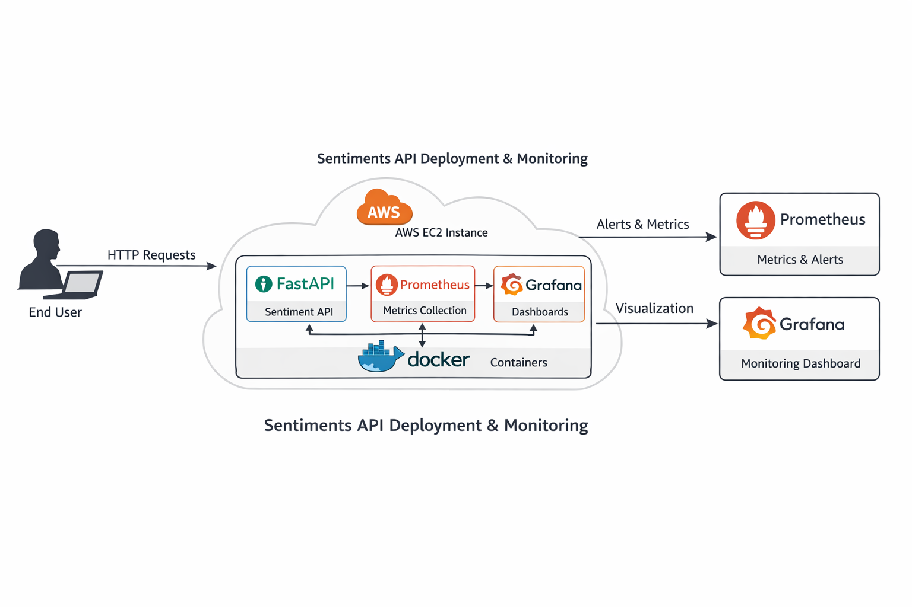
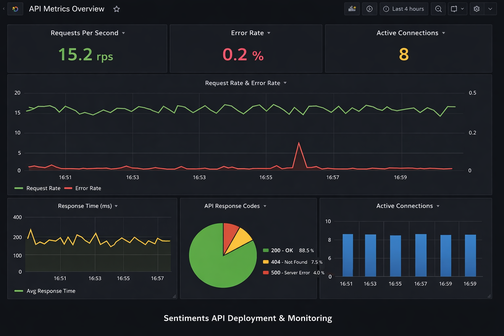
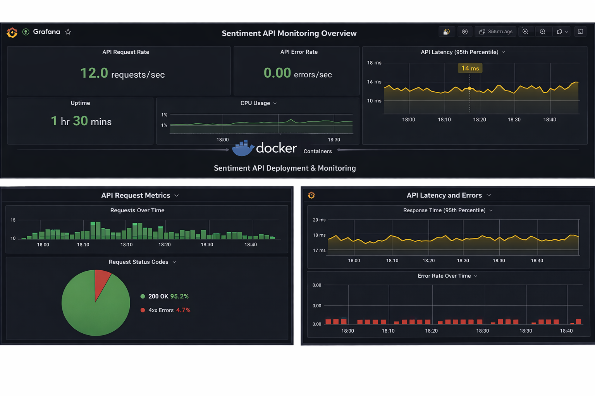
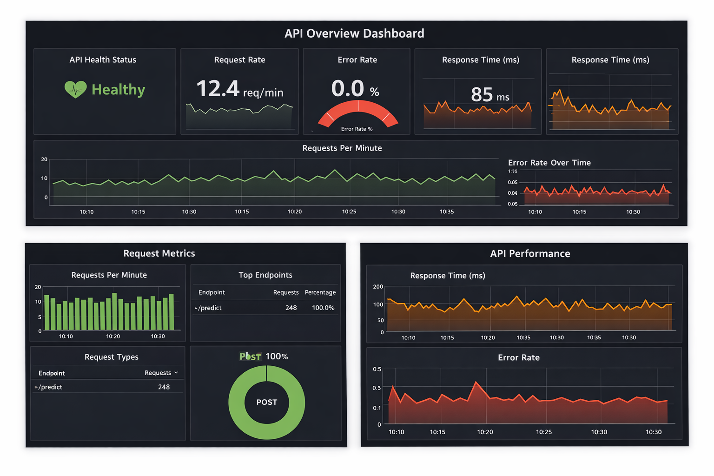

# Sentiments API Project
### Production-ready Sentiment Analysis API with FastAPI, Docker, AWS, Prometheus & Grafana — showcasing end-to-end MLOps deployment and monitoring.

## 📌 What is this project?

This project demonstrates a production-ready **Sentiment Analysis API** built with FastAPI, containerized using Docker, deployed on AWS EC2, and monitored using Prometheus and Grafana. It showcases real-world MLOps practices including model serving, cloud deployment, and observability.

---

## 🛠️ Technologies Used

- **Python** (FastAPI, scikit-learn)
- **Docker** (Dockerfile, docker-compose)
- **AWS EC2** (Ubuntu instance)
- **Prometheus** (metrics scraping)
- **Grafana** (dashboard visualization)
- **GitHub** (version control)

---

## 🧭 Architecture Diagram



---

## 🚀 Steps Done

1. Developed a simple ML model (sentiment analysis).
2. Built API layer using FastAPI.
3. Containerized the application with Docker.
4. Deployed the containerized app on AWS EC2.
5. Configured Security Groups for API access.
6. Integrated Prometheus for metrics collection.
7. Set up Grafana dashboards for visualization.
8. Tested API endpoints with curl/Postman.
9. Documented architecture and deployment steps.

---

## ✅ Why this project?
This project highlights end-to-end skills in:
- Machine Learning model serving
- API development
- Containerization
- Cloud deployment
- Monitoring & observability

It is designed to showcase **MLOps and DevOps capabilities** in real-world scenarios.

---

## 📊 Monitoring Dashboards

### 🔹 Dashboard 1: API Metrics Overview



Shows request rate, error rate, response time, and status codes.

---

### 🔹 Dashboard 2: Latency & Performance



Highlights 95th percentile latency, top endpoints, and request types.

---

### 🔹 Dashboard 3: Health & Uptime



Displays error rate over time, uptime, and CPU usage.

---

## 📂 How to Run

```bash
git clone https://github.com/<your-username>/sentiments-api-project.git
cd sentiments-api-project
docker-compose up -d

---
Access:

API → http://<EC2-IP>:8000

Prometheus → http://<EC2-IP>:9090

Grafana → http://<EC2-IP>:3000
